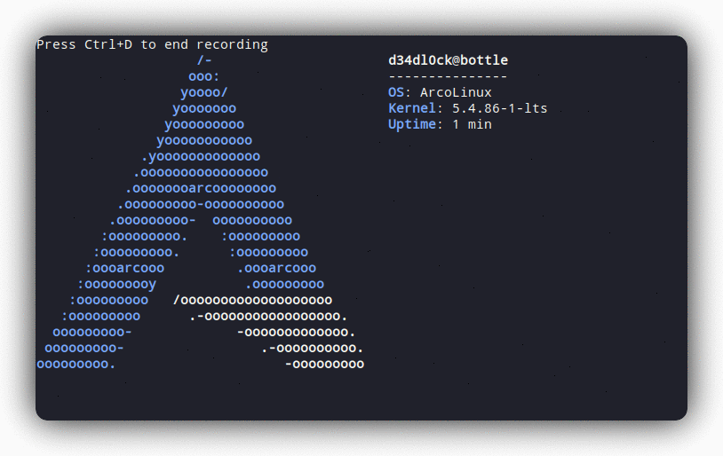
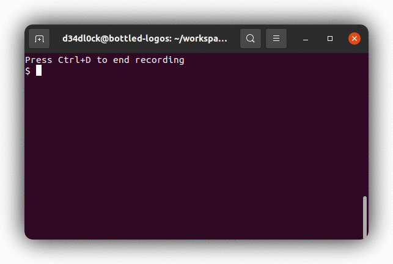
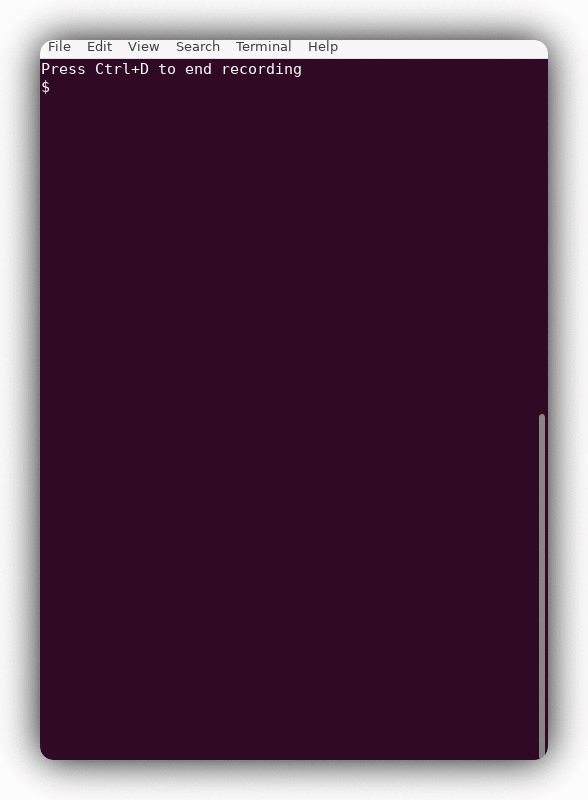
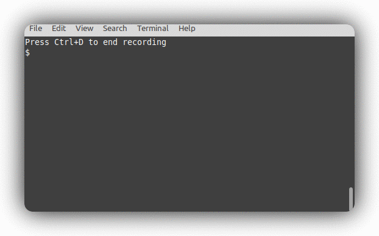
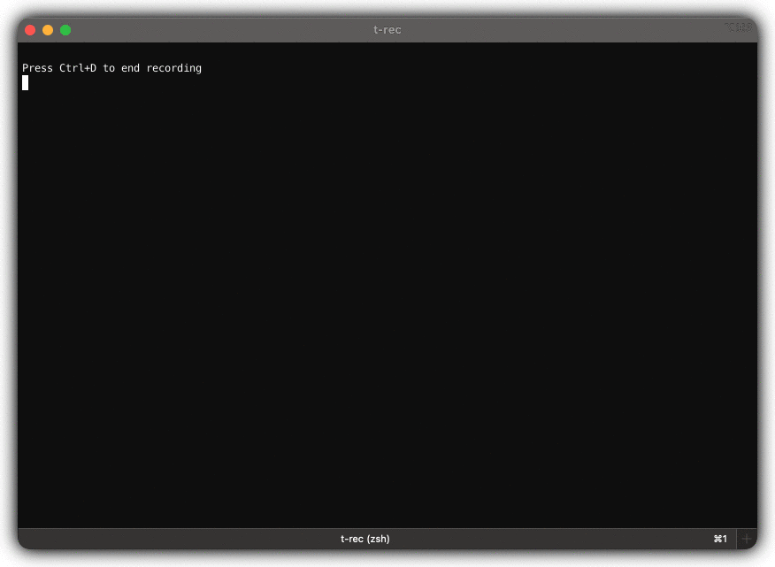

# Changelog
All notable changes to this project will be documented in this file.

The format is based on [Keep a Changelog](https://keepachangelog.com/en/1.0.0/),
and this project adheres to [Semantic Versioning](https://semver.org/spec/v2.0.0.html).

## [Unreleased]

## [0.8.2](https://github.com/sassman/t-rec-rs/compare/v0.8.1...v0.8.2) - 2025-12-19

### Fixed

- fix hardcoded video framerate, now respects cli/profile ([#312](https://github.com/sassman/t-rec-rs/pull/312))

## [0.8.1](https://github.com/sassman/t-rec-rs/compare/v0.8.0...v0.8.1) - 2025-12-01

### Added

- Improve CLI help readability and fix config path docs ([#305](https://github.com/sassman/t-rec-rs/pull/305))

### Fixed

- restore terminal state after video prompt timeout ([#303](https://github.com/sassman/t-rec-rs/pull/303))

### Other

- update ventura wallpaper and upgrade dependencies ([#302](https://github.com/sassman/t-rec-rs/pull/302))

## [0.8.0](https://github.com/sassman/t-rec-rs/compare/v0.7.11...v0.8.0) - 2025-11-30

### Added

- add interactive prompt for video generation ([#298](https://github.com/sassman/t-rec-rs/pull/298))
- configurable framerate for smoother animations ([#296](https://github.com/sassman/t-rec-rs/pull/296))

## [0.7.11](https://github.com/sassman/t-rec-rs/compare/v0.7.10...v0.7.11) - 2025-11-30

### Added

- add config file with profiles support ([#295](https://github.com/sassman/t-rec-rs/pull/295))
- support custom wallpaper images ([#294](https://github.com/sassman/t-rec-rs/pull/294))
- add --wallpaper option with macOS Ventura background ([#292](https://github.com/sassman/t-rec-rs/pull/292))

## [0.7.10](https://github.com/sassman/t-rec-rs/compare/v0.7.9...v0.7.10) - 2025-11-15

### Added

- make 3s the default idle-pause for more readable demo recordings ([#288](https://github.com/sassman/t-rec-rs/pull/288))
- *(tip)* add a tip for the idle pause flag feature from pr #267 ([#287](https://github.com/sassman/t-rec-rs/pull/287))
- add --idle-pause <time> to set the max time before idle frame optimization. Can improve readability. ([#267](https://github.com/sassman/t-rec-rs/pull/267))

### Other

- *(deps)* bump clap from 4.5.50 to 4.5.51 ([#286](https://github.com/sassman/t-rec-rs/pull/286))
- *(deps)* bump core-foundation from 0.10.0 to 0.10.1 ([#261](https://github.com/sassman/t-rec-rs/pull/261))
- *(deps)* bump humantime from 2.1.0 to 2.3.0 ([#279](https://github.com/sassman/t-rec-rs/pull/279))
- *(deps)* bump rayon from 1.10.0 to 1.11.0 ([#270](https://github.com/sassman/t-rec-rs/pull/270))
- *(deps)* bump anyhow from 1.0.97 to 1.0.100 ([#281](https://github.com/sassman/t-rec-rs/pull/281))
- *(deps)* bump log from 0.4.26 to 0.4.28 ([#278](https://github.com/sassman/t-rec-rs/pull/278))
- *(deps)* bump simplerand from 1.5.1 to 1.6.0 ([#266](https://github.com/sassman/t-rec-rs/pull/266))
- *(deps)* bump clap from 4.5.32 to 4.5.49 ([#285](https://github.com/sassman/t-rec-rs/pull/285))
- fix typos ([#264](https://github.com/sassman/t-rec-rs/pull/264))
- *(deps)* bump tempfile from 3.19.1 to 3.23.0 ([#283](https://github.com/sassman/t-rec-rs/pull/283))
- *(deps)* bump image from 0.25.5 to 0.25.8 ([#277](https://github.com/sassman/t-rec-rs/pull/277))
- *(deps)* bump clap from 4.5.31 to 4.5.32 ([#245](https://github.com/sassman/t-rec-rs/pull/245))
- *(deps)* bump tempfile from 3.18.0 to 3.19.1 ([#246](https://github.com/sassman/t-rec-rs/pull/246))

## [0.7.9](https://github.com/sassman/t-rec-rs/compare/v0.7.8...v0.7.9) - 2025-03-15

### Other

- *(deps)* bump tempfile from 3.17.1 to 3.18.0 ([#239](https://github.com/sassman/t-rec-rs/pull/239))
- *(deps)* bump anyhow from 1.0.96 to 1.0.97 ([#240](https://github.com/sassman/t-rec-rs/pull/240))
- *(deps)* bump log from 0.4.25 to 0.4.26 ([#234](https://github.com/sassman/t-rec-rs/pull/234))
- *(deps)* bump anyhow from 1.0.95 to 1.0.96 ([#235](https://github.com/sassman/t-rec-rs/pull/235))
- *(deps)* bump tempfile from 3.15.0 to 3.17.1 ([#237](https://github.com/sassman/t-rec-rs/pull/237))

## [0.7.8](https://github.com/sassman/t-rec-rs/compare/v0.7.7...v0.7.8) - 2025-01-14

### Added

- implement alphabetically sorted window list (see #221) (#223)
- cmd line argument alias `--ls` for `--ls-win` (see #220) (#222)

### Other

- *(deps)* bump anyhow from 1.0.68 to 1.0.95 (#217)
- *(deps)* bump tempfile from 3.3.0 to 3.15.0 (#218)
- *(deps)* bump simplerand from 1.3.0 to 1.5.1 (#216)

## [0.7.7](https://github.com/sassman/t-rec-rs/compare/v0.7.6...v0.7.7) - 2025-01-11

### Fixed

- When used with `--quiet`, don't print a blank line on startup. (#210)

### Other

- update dependencies + minor changes (#212)
- Update help output (#209)

## [0.7.6] - 2023-01-21
[0.7.6]: https://github.com/sassman/t-rec-rs/compare/v0.7.5...v0.7.6

### Changed
- [chore(deps): bump clap from 3.2.23 to 4.1.1](https://github.com/sassman/t-rec-rs/pull/184)
- [chore(deps): bump anyhow from 1.0.66 to 1.0.68](https://github.com/sassman/t-rec-rs/pull/181)
- [chore(deps): bump rayon from 1.6.0 to 1.6.1](https://github.com/sassman/t-rec-rs/pull/180)
- [chore(clippy): fix clippy lints](https://github.com/sassman/t-rec-rs/pull/178)
- [chore(deps): bump env_logger from 0.9.1 to 0.10.0](https://github.com/sassman/t-rec-rs/pull/177)
- [chore(deps): bump anyhow from 1.0.65 to 1.0.66](https://github.com/sassman/t-rec-rs/pull/168)
- [Allow building on NetBSD](https://github.com/sassman/t-rec-rs/pull/164)

### Contributors
- [0323pin](https://github.com/0323pin)
- [dependabot[bot]](https://github.com/apps/dependabot)
- [sassman](https://github.com/sassman)

## [0.7.5] - 2022-10-04
[0.7.5]: https://github.com/sassman/t-rec-rs/compare/v0.7.4...v0.7.5

### Changed
- update dependencies (#161)

### Contributors
- [sassman](https://github.com/sassman)

## [0.7.4] - 2022-07-04
[0.7.4]: https://github.com/sassman/t-rec-rs/compare/v0.7.3...v0.7.4

### Changed
- [chore(deps): bump clap from 3.2.5 to 3.2.8](https://github.com/sassman/t-rec-rs/pull/145)
- [chore(deps): bump anyhow from 1.0.56 to 1.0.58](https://github.com/sassman/t-rec-rs/pull/143)
- [chore(deps): bump clap from 3.1.9 to 3.2.5](https://github.com/sassman/t-rec-rs/pull/142)
- [chore(deps): bump rayon from 1.5.2 to 1.5.3](https://github.com/sassman/t-rec-rs/pull/140)
- [chore(deps): bump log from 0.4.16 to 0.4.17](https://github.com/sassman/t-rec-rs/pull/137)
- [chore(deps): bump image from 0.24.1 to 0.24.2](https://github.com/sassman/t-rec-rs/pull/136)
- [fix: clippy lints with latest rustc](https://github.com/sassman/t-rec-rs/pull/132)
- [chore(deps): bump rayon from 1.5.1 to 1.5.2](https://github.com/sassman/t-rec-rs/pull/131)
- [chore(deps): bump clap from 3.1.8 to 3.1.9](https://github.com/sassman/t-rec-rs/pull/130)
- [chore(deps): bump clap from 3.1.6 to 3.1.8](https://github.com/sassman/t-rec-rs/pull/129)
- [chore(deps): bump log from 0.4.14 to 0.4.16](https://github.com/sassman/t-rec-rs/pull/127)

### Contributors

- [dependabot[bot]](https://github.com/apps/dependabot)
- [sassman](https://github.com/sassman)

## [0.7.3] - 2022-03-15
[0.7.3]: https://github.com/sassman/t-rec-rs/compare/v0.7.2...v0.7.3

### Changed
- [chore(deps): bump clap from 3.1.3 to 3.1.5](https://github.com/sassman/t-rec-rs/pull/124)
- [chore(deps): bump clap from 3.1.5 to 3.1.6](https://github.com/sassman/t-rec-rs/pull/126)
- [chore(deps): bump anyhow from 1.0.55 to 1.0.56](https://github.com/sassman/t-rec-rs/pull/125)
- [fix(ci): fix undefined variables on release asset builds](https://github.com/sassman/t-rec-rs/pull/123)

## Contributors
- [dependabot[bot]](https://github.com/apps/dependabot)
- [sassman](https://github.com/sassman)

## [0.7.2] - 2022-03-02
[0.7.2]: https://github.com/sassman/t-rec-rs/compare/v0.7.1...v0.7.2

### Changed
- [chore(deps): bump clap from 3.0.14 to 3.1.3](https://github.com/sassman/t-rec-rs/pull/121)
- [chore(deps): bump image from 0.24.0 to 0.24.1](https://github.com/sassman/t-rec-rs/pull/114)
- [fix(clippy): fix enum variant names lint](https://github.com/sassman/t-rec-rs/pull/119)
- [fix(ci): release-binary-assets.yml](https://github.com/sassman/t-rec-rs/pull/111)

### Contributors
- [dependabot[bot]](https://github.com/apps/dependabot)
- [sassman](https://github.com/sassman)

## [0.7.1] - 2022-02-12
[0.7.1]: https://github.com/sassman/t-rec-rs/compare/v0.7.0...v0.7.1

### Changed
- [feat(#105): add support configuring output](https://github.com/sassman/t-rec-rs/pull/107)
- [feat(#100): dedicating an own cli argument for external window recording](https://github.com/sassman/t-rec-rs/pull/102)
- [fix(#103): fix release binaries for linux](https://github.com/sassman/t-rec-rs/pull/106)
- [fix(#109): on ubuntu 20.04 for arm the recording is upside down](https://github.com/sassman/t-rec-rs/pull/110)
- [chore(deps): bump image from 0.23.14 to 0.24.0](https://github.com/sassman/t-rec-rs/pull/108)
- [chore(deps): bump dependencies + clap3 migration](https://github.com/sassman/t-rec-rs/pull/101)

### Contributors
- [sassman](https://github.com/sassman)

## [0.7.0] - 2022-02-03
[0.7.0]: https://github.com/sassman/t-rec-rs/compare/v0.6.2...v0.7.0

### Changed
- [feat(#100): dedicating an own cli argument for external window recording](https://github.com/sassman/t-rec-rs/pull/102)
  with this PR also the default decor has changed to `none`. 
  If you want the previous behaviour please pass `-d shadow` as cli argument. 
- [chore(deps): bump dependencies + clap3 migration](https://github.com/sassman/t-rec-rs/pull/101)
- [chore(deps): bump versions](https://github.com/sassman/t-rec-rs/pull/92)

## Contributors
- [sassman](https://github.com/sassman)

## [0.6.2] - 2021-12-29
[0.6.2]: https://github.com/sassman/t-rec-rs/compare/v0.6.2...v0.6.1
### Changed
- [chore(deps): bump dependencies](https://github.com/sassman/t-rec-rs/pull/92)

## [0.6.1] - 2021-08-30
[0.6.1]: https://github.com/sassman/t-rec-rs/compare/v0.6.1...v0.6.0
### Changed
- [chore(deps): bump anyhow from 1.0.42 to 1.0.43](https://github.com/sassman/t-rec-rs/pull/80)
- ["-p" option is not exist](https://github.com/sassman/t-rec-rs/pull/79)
- [chore(deps): bump env_logger from 0.8.3 to 0.9.0](https://github.com/sassman/t-rec-rs/pull/78)
- [chore(deps): bump anyhow from 1.0.40 to 1.0.42](https://github.com/sassman/t-rec-rs/pull/77)
- [chore(deps): bump rayon from 1.5.0 to 1.5.1](https://github.com/sassman/t-rec-rs/pull/75)

### Contributors
- [dependabot[bot]](https://github.com/apps/dependabot)
- [kuy](https://github.com/kuy)
- [sassman](https://github.com/sassman)

## [0.6.0] - 2021-05-07
### Changed
- [feat(video-only): add command line parameter `--video-only | -M`](https://github.com/sassman/t-rec-rs/pull/73)
- [refactor(human-readable): time display](https://github.com/sassman/t-rec-rs/pull/72)
- [feat(pre/post-pause): mainly pre-post pause feature](https://github.com/sassman/t-rec-rs/pull/70)
- [chore(ci:release): change machine to ubuntu for fixing the deb build](https://github.com/sassman/t-rec-rs/pull/67)

### Contributors
- [sassman](https://github.com/sassman)

## [0.5.2] - 2021-05-01
### Changed
- [chore(ci:release): change machine to ubuntu for fixing the deb build](https://github.com/sassman/t-rec-rs/pull/67)
- [fix(WINDOWID): handle a missing window id graceful see #65](https://github.com/sassman/t-rec-rs/pull/66)
- [Upgrade to GitHub-native Dependabot](https://github.com/sassman/t-rec-rs/pull/64)
- [README: add Macports install instructions](https://github.com/sassman/t-rec-rs/pull/63)

### Contributors
- [dependabot-preview[bot]](https://github.com/apps/dependabot-preview)
- [herbygillot](https://github.com/herbygillot)
- [sassman](https://github.com/sassman)

## [0.5.1] - 2021-04-03
### Changed
- [chore(deps): bump anyhow from 1.0.39 to 1.0.40](https://github.com/sassman/t-rec-rs/pull/60)
- [chore(deps): bump anyhow from 1.0.38 to 1.0.39](https://github.com/sassman/t-rec-rs/pull/59)
- [chore(deps): bump image from 0.23.13 to 0.23.14](https://github.com/sassman/t-rec-rs/pull/58)
- [chore(clippy): make clippy happy](https://github.com/sassman/t-rec-rs/pull/56)
- [feat(ci): add .deb as regular build artifact](https://github.com/sassman/t-rec-rs/pull/54)
- [chore(deps): bump image from 0.23.12 to 0.23.13](https://github.com/sassman/t-rec-rs/pull/53)
- [chore(deps): bump log from 0.4.13 to 0.4.14](https://github.com/sassman/t-rec-rs/pull/52)
- [docs(README): add AUR installation instructions](https://github.com/sassman/t-rec-rs/pull/50)
- [feat(mp4): add cli option for generating a video](https://github.com/sassman/t-rec-rs/pull/49)

### Contributors
- [dependabot-preview[bot]](https://github.com/apps/dependabot-preview)
- [orhun](https://github.com/orhun)
- [sassman](https://github.com/sassman)

## [0.5.0] - 2021-01-24
### Added
- Video output feature: (`--video` or `-m`) now additionally generates a (H.256) `.mp4` file parallel to the `.gif`. [pull/49](https://github.com/sassman/t-rec-rs/pull/49), [issues/45](https://github.com/sassman/t-rec-rs/issues/45), [fd600e0]
- Release ci pipeline now produces a debian package file and attaches it to the release [7e8ca49]
- t-rec has now an own pixel art logo [e511731]
- more installation hints for linux [7a1b152]
### Changed
- set default bg value to transparent, closes [issues/46](https://github.com/sassman/t-rec-rs/issues/46), [pull/47](https://github.com/sassman/t-rec-rs/pull/47), [24c3049]
- updated dependencies
### Removed
- snap: remove unsupported i386 architecture [41178ea]

## [0.4.3] - 2021-01-05
### Added
- Quiet (-q|--quiet) mode to suppress Ctrl+D banner: 'Press Ctrl+D to end recording' [pull/39](https://github.com/sassman/t-rec-rs/pull/39), thanks to [@Daviey](https://github.com/Daviey)
### Changed
- Changelog now contains the release links

## [0.4.2] - 2021-01-04
### Added
- ArcoLinux 5.4 on Xfwm4 to the list of tested distros

### Fixed
- fixed issues on terminals with transparency (or where the compositor caused transparency) on Linux see [issue/26](https://github.com/sassman/t-rec-rs/issues/26) / [pull/38](https://github.com/sassman/t-rec-rs/pull/38)

## [0.4.1] - 2021-01-03
### Added
- Snap support on it's way to [snapcraft.io](https://snapcraft.io/t-rec) [pull/25], thanks to [@popey](https://github.com/popey)
### Fixed
- reduced crate size from 4.8MB to 34kB [pull/32], thanks to [@Byron](https://github.com/Byron)
- fixed a panic when the active window cannot be identified on Linux [pull/31] / [issue/30]
- fixed `t-rec -l` did not show any window names on Linux [pull/31]
- fixed system freeze on "Applying Effects" caused by too many threads [issue/29]

[pull/32]: https://github.com/sassman/t-rec-rs/pull/32
[pull/31]: https://github.com/sassman/t-rec-rs/pull/31
[pull/25]: https://github.com/sassman/t-rec-rs/pull/25
[issue/30]: https://github.com/sassman/t-rec-rs/issues/30
[issue/29]: https://github.com/sassman/t-rec-rs/issues/29

## [0.4.0] - 2020-12-27
### Added
- t-rec runs now on linux (X11 only) [issues/1] and has been tested on the following systems:
  - ubuntu 20.10 on GNOME 
  - ubuntu 20.10 on i3wm 
  - mint 20 on cinnamon 
  
[issues/1]: https://github.com/sassman/t-rec-rs/issues/1

### Fixed
- clear screen before starting the recording was somehow broken, it behaves now better

## [0.3.1] - 2020-12-18
### Added
- Readme badge for dependencies and latest version on crates.io
### Fixed
- updated dependencies

## [0.3.0] - 2020-12-07
### Added
- command line parameter `-d` or `--decor` that allows to turn on and off effects [issues/18] / [pull/19]
- command line parameter `-b` or `--bg` that allows to change the target background color to white, black or transparent [pull/19]
- command line parameter `-v` or `--verbose` that shows insights on the window name and window id for the curious [pull/19]
- turn on the new shadow decor effect by default [pull/19]

[pull/19]: https://github.com/sassman/t-rec-rs/pull/19
[issues/18]: https://github.com/sassman/t-rec-rs/issues/18

### Fixed
- white corners are now fixed and aligned with the radius of macos big sur [issues/17] / [pull/19]
- sometimes there were unexpected image dimensions, with a small stripe on the right of black pixel [pull/19]

[pull/19]: https://github.com/sassman/t-rec-rs/pull/19
[issues/17]: https://github.com/sassman/t-rec-rs/issues/17

## [0.2.2] - 2020-11-26
### Fixed
- improve error handling for invalid captured image data [pull/15]
  
[pull/15]: https://github.com/sassman/t-rec-rs/pull/15

## [0.2.1] - 2020-11-17
### Fixed
- improve error handling for invalid window id [issue/13] / [pull/14]
  
[issue/13]: https://github.com/sassman/t-rec-rs/issues/13
[pull/14]: https://github.com/sassman/t-rec-rs/pull/14

## [0.2.0] - 2020-10-12
### Added
- command line parameter for natural recording `-n` or `--natural`
- feature to avoid identical frames, where nobody sees some progress happening [issue/10] / [pull/11]
  
[issue/10]: https://github.com/sassman/t-rec-rs/issues/10
[pull/11]: https://github.com/sassman/t-rec-rs/pull/11

## [0.1.2] - 2020-10-12
### Added
- CHANGELOG.md follows now a [new format](https://keepachangelog.com/en/1.0.0/)
- feature to check for `convert` on launch [issue/6] / [pull/7]
- feature to avoid overwriting existing final gif [issue/8] / [pull/9]

[issue/6]: https://github.com/sassman/t-rec-rs/issues/6
[issue/8]: https://github.com/sassman/t-rec-rs/issues/8
[pull/7]: https://github.com/sassman/t-rec-rs/pull/7
[pull/9]: https://github.com/sassman/t-rec-rs/pull/9

## [0.1.1] - 2020-10-11
### Fixed
- Segmentation fault on listing the windows `t-rec -l` [issue/4]

## [0.1.0] - 2020-10-10
### Added
- Basic recoding functionality with 4 FPS
- Generating a gif out of n frames of a recording
- CI pipeline as GitHub Actions workflow

[issue/4]: https://github.com/sassman/t-rec-rs/issues/4

[0.6.0]: https://github.com/sassman/t-rec-rs/compare/v0.6.0...v0.5.2
[0.5.2]: https://github.com/sassman/t-rec-rs/compare/v0.5.2...v0.5.1
[0.5.1]: https://github.com/sassman/t-rec-rs/compare/v0.5.1...v0.5.0
[0.5.0]: https://github.com/sassman/t-rec-rs/compare/v0.5.0...v0.4.3
[0.4.3]: https://github.com/sassman/t-rec-rs/compare/v0.4.2...v0.4.3
[0.4.2]: https://github.com/sassman/t-rec-rs/compare/v0.4.1...v0.4.2
[0.4.1]: https://github.com/sassman/t-rec-rs/compare/v0.4.0...v0.4.1
[0.4.0]: https://github.com/sassman/t-rec-rs/compare/v0.3.1...v0.4.0
[0.3.1]: https://github.com/sassman/t-rec-rs/compare/v0.3.0...v0.3.1
[0.3.0]: https://github.com/sassman/t-rec-rs/compare/v0.2.2...v0.3.0
[0.2.2]: https://github.com/sassman/t-rec-rs/compare/v0.2.1...v0.2.2
[0.2.1]: https://github.com/sassman/t-rec-rs/compare/v0.2.0...v0.2.1
[0.2.0]: https://github.com/sassman/t-rec-rs/compare/v0.1.2...v0.2.0
[0.1.2]: https://github.com/sassman/t-rec-rs/compare/v0.1.1...v0.1.2
[0.1.1]: https://github.com/sassman/t-rec-rs/compare/v0.1.0...v0.1.1
[0.1.0]: https://github.com/sassman/t-rec-rs/compare/v0.1.0-beta.1...v0.1.0
[0.1.0-beta.1]: https://github.com/sassman/t-rec-rs/compare/v0.1.0-beta.1...v0.1.0
