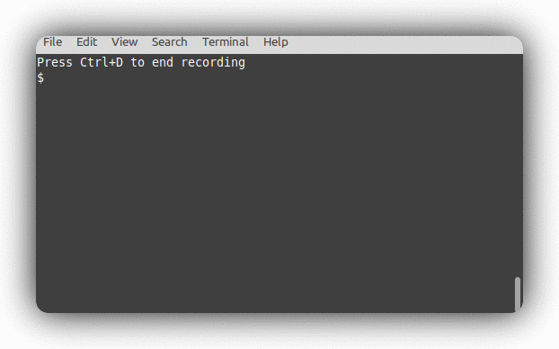

<div align="center">
 
 <h1><strong>t-rec: Terminal Recorder</strong></h1>

[](https://www.gnu.org/licenses/gpl-3.0)
[](https://crates.io/crates/t-rec)
[](https://deps.rs/repo/github/sassman/t-rec-rs)
[](https://github.com/sassman/t-rec-rs/actions?query=branch%3Amain+workflow%3ABuild+)
[](https://github.com/Aaronepower/tokei)

Blazingly fast terminal recorder that generates animated gif images for the web written in rust.

</div>


# Demo


## Features
- Screenshotting your terminal with configurable framerate (4-15 fps)
- Generates high quality small sized animated gif images or mp4 videos
- **built-in idle frames detection and optimization** (for super fluid presentations)
- Applies (can be disabled) border decor effects like drop shadow
- Runs on Windows, MacOS, Linux and NetBSD
- Uses native efficient APIs
- Runs without any cloud service and entirely offline
- No issues with terminal sizes larger than 80x24
- No issues with fonts or colors
- No issues with curses based programs
- No issues with escape sequences
- No record and replay - just one simple command to rule them all
- Can record every arbitrary window you want (e.g. browser, ide)
- Written in Rust 🦀

## Installation on MacOS
### with homebrew
```sh
brew install t-rec
```

### with macports
```sh
sudo port selfupdate
sudo port install t-rec
```

### with cargo
**NOTE** `t-rec` depends on `imagemagick`.
```sh
brew install imagemagick
cargo install -f t-rec
```
**NOTE** `-f` just makes sure the latest version is installed

## Installation on Linux
### as .deb

```sh
sudo apt-get install imagemagick
wget https://github.com/sassman/t-rec-rs/releases/download/v0.5.0/t-rec_0.5.0_amd64.deb
sudo dpkg -i t-rec_0.5.0_amd64.deb
```

### as snap

[](https://snapcraft.io/t-rec)

- installation [for Linux Mint](https://snapcraft.io/install/t-rec/mint)
- installation [for Arch Linux](https://snapcraft.io/install/t-rec/arch)

*TL;DR:*
```sh
sudo snap install t-rec --classic
/snap/bin/t-rec --version
t-rec 0.4.3
```

### from AUR

`t-rec` can be installed from available [AUR packages](https://aur.archlinux.org/packages/?O=0&SeB=nd&K=Blazingly+fast+terminal+recorder&outdated=&SB=n&SO=a&PP=50&do_Search=Go) using an [AUR helper](https://wiki.archlinux.org/index.php/AUR_helpers). For example,

```
paru -S t-rec
```

If you prefer, you can clone the [AUR packages](https://aur.archlinux.org/packages/?O=0&SeB=nd&K=Blazingly+fast+terminal+recorder&outdated=&SB=n&SO=a&PP=50&do_Search=Go) and then compile them with [makepkg](https://wiki.archlinux.org/index.php/Makepkg). For example,

```
git clone https://aur.archlinux.org/t-rec.git
cd t-rec
makepkg -si
```

### Installation on NetBSD
```
pkgin install t-rec
```

Or, if you prefer to build from source,
```
cd /usr/pkgsrc/multimedia/t-rec
make install
```

## Installation on Windows

### Prerequisites

t-rec requires ImageMagick and optionally ffmpeg for video generation. Install them using winget:

```powershell
# Install ImageMagick (required for GIF generation and effects)
winget install ImageMagick.ImageMagick

# Install ffmpeg (optional, for MP4 video generation)
winget install ffmpeg
```

### with cargo

After installing the prerequisites:

```powershell
cargo install -f t-rec
```

**Note:** Make sure ImageMagick and ffmpeg are in your PATH after installation. You may need to restart your terminal.

### with cargo (Linux)
```sh
sudo apt-get install libx11-dev imagemagick
cargo install -f t-rec
```

| tested on those distros |
|-------------------------|
| ubuntu 20.10 on GNOME |
|  |
| ubuntu 20.10 on i3wm |
|  |
| linux mint 20 on cinnamon |
|  |
| ArcoLinux 5.4 on Xfwm4 |
|  |

## Usage
```sh
t-rec
```

or with specifying a different program to launch

```sh
t-rec /bin/sh
```

### Full Options

```text
Blazingly fast terminal recorder that generates animated gif images for the web written in rust.

Usage: 

Arguments:
  [PROGRAM]  Shell or program to launch. Defaults to $SHELL

Options:
  -v, --verbose
          Enable verbose insights for the curious
  -q, --quiet
          Quiet mode, suppresses the banner: 'Press Ctrl+D to end recording'
  -m, --video
          Generates additionally to the gif a mp4 video of the recording
  -M, --video-only
          Generates only a mp4 video and not gif
  -d, --decor <DECOR>
          Decorates the animation with certain, mostly border effects [default: none] [possible values: shadow, none]
  -p, --wallpaper <WALLPAPER>
          Wallpaper background. Use 'ventura' for built-in, or provide a path to a custom image (PNG, JPEG, TGA)
      --wallpaper-padding <WALLPAPER_PADDING>
          Padding in pixels around the recording when using --wallpaper [default: 60]
  -b, --bg <BG>
          Background color when decors are used [default: transparent] [possible values: white, black, transparent]
  -n, --natural
          If you want a very natural typing experience and disable the idle detection and sampling optimization
  -l, --ls-win
          If you want to see a list of windows available for recording by their id [aliases: --ls]
  -w, --win-id <WIN_ID>
          Window Id (see --ls-win) that should be captured, instead of the current terminal
  -e, --end-pause <END_PAUSE>
          Pause time at the end of the animation (e.g., "2s", "500ms")
  -s, --start-pause <START_PAUSE>
          Pause time at the start of the animation (e.g., "1s", "200ms")
  -i, --idle-pause <IDLE_PAUSE>
          Max idle time before optimization kicks in. Can enhance readability [default: 3s]
  -o, --output <OUTPUT>
          Output file without extension [default: t-rec]
  -f, --fps <FPS>
          Capture framerate, 4-15 fps. Higher = smoother but larger files [default: 4]
      --profile <PROFILE>
          Use a named profile from the config file
      --init-config
          Create a starter config file at `~/.config/t-rec/config.toml` (linux) or `~/Library/Application Support/t-rec/config.toml` (macOS)
      --list-profiles
          List available profiles from the config file
  -h, --help
          Print help
  -V, --version
          Print version
```

### Configuration File

You can save your preferred settings in a config file to avoid typing them every time.

**Quick start:**

```sh
# Create a starter config file
t-rec --init-config

# List available profiles
t-rec --list-profiles

# Use a profile
t-rec --profile demo
```

**Config file locations** (searched in order):
1. `./t-rec.toml` (project-local)
2. `~/.config/t-rec/config.toml` (Linux)
2. `~/Library/Application Support/t-rec/config.toml` (macOS)
3. `%APPDATA%\t-rec\config.toml` (Windows)

**Example config file:**

```toml
# Default settings applied to all recordings
[default]
wallpaper = "ventura"
wallpaper-padding = 80

# Named profiles for different use cases
[profiles.demo]
wallpaper = "ventura"
wallpaper-padding = 120
start-pause = "10s"
idle-pause = "5s"

[profiles.quick]
quiet = true
idle-pause = "1s"

# Custom wallpaper with $HOME expansion
[profiles.custom]
wallpaper = "$HOME/Pictures/my-wallpaper.png"
wallpaper-padding = 80
```

**Using profiles:**

```sh
# Use default settings from config
t-rec

# Use a specific profile
t-rec --profile demo

# Override a profile setting
t-rec --profile demo --wallpaper-padding 150

# List available profiles
t-rec --list-profiles
```

**Available config options:**

| Option | Type | Description |
|--------|------|-------------|
| `verbose` | bool | Enable verbose output |
| `quiet` | bool | Suppress the Ctrl+D banner |
| `video` | bool | Also generate mp4 video |
| `video-only` | bool | Only generate mp4, no gif |
| `decor` | string | Border decoration (`shadow`, `none`) |
| `wallpaper` | string | Wallpaper preset or file path (supports `$HOME`) |
| `wallpaper-padding` | number | Padding around recording (1-500) |
| `bg` | string | Background color (`white`, `black`, `transparent`) |
| `natural` | bool | Disable idle detection |
| `start-pause` | string | Pause at start (e.g., `2s`, `500ms`) |
| `end-pause` | string | Pause at end |
| `idle-pause` | string | Max idle time before optimization |
| `output` | string | Output filename (without extension) |
| `fps` | number | Capture framerate, 4-15 (default: 4) |

**Note:** CLI arguments always override config file settings.

### Smoother Animations

For smoother typing animations in demos, increase the capture framerate:

```sh
# Smooth typing (10 fps)
t-rec --fps 10

# Very smooth (15 fps)
t-rec --fps 15
```

**Note:** Higher framerates produce larger files. The default 4 fps is recommended for most use cases.

### Video Generation

After recording, t-rec will ask if you also want to generate an MP4 video:

```
🎉 🚀 Generating t-rec.gif

🎬 Also generate MP4 video? (y/n) ›
(auto-skip in 15s)
```

- Press `y` to generate both GIF and MP4
- Press `n` or wait 15 seconds to skip

To always generate video without being asked, use the `--video` flag:

```sh
t-rec --video          # Generate both GIF and MP4
t-rec --video-only     # Generate only MP4, no GIF
```

The prompt is skipped in quiet mode (`-q`) or non-interactive environments.

### Disable idle detection & optimization

If you are not happy with the idle detection and optimization, you can disable it with the `-n` or `--natural` parameter.
By doing so, you would get the very natural timeline of typing and recording as you do it.
In this case there will be no optimizations performed.

Alternatively, you can keep recording idle time before optimization kicks in with the `--idle-pause` parameter.
This gives viewers time to read the text on screen before the animation jumps to the next change:
```sh
t-rec --idle-pause 1s        # Show 1 second of unchanged content before optimization
t-rec --idle-pause 500ms     # Show 500ms of idle time
```

NOTE: The default value is `3s`.

### Enable shadow border decor

In order to enable the drop shadow border decor you have to pass `-d shadow` as an argument. If you only want to change
the color of the background you can use `-b black` for example to have a black background.

### Record Arbitrary windows

You can record not only the terminal but also every other window. There 3 ways to do so:

1) use `-w | --win-id` argument to name the Window Id that should be recorded
```sh
t-rec --ls-win | grep -i calc
Calculator | 45007

t-rec -w 45007
```

2) use the env var `TERM_PROGRAM` like this:
- for example lets record a window 'Google Chrome'
- make sure chrome is running and visible on screen
```sh
TERM_PROGRAM="google chrome" t-rec

Frame cache dir: "/var/folders/m8/084p1v0x4770rpwpkrgl5b6h0000gn/T/trec-74728.rUxBx3ohGiQ2"
Recording window: "Google Chrome 2"
Press Ctrl+D to end recording

```

this is how it looks then:


3) use the env var `WINDOWID` like this:
- for example let's record a `VSCode` window
- figure out the window id program, and make it
- make sure the window is visible on screen
- set the variable and run `t-rec`

```sh
t-rec --ls-win | grep -i code
Code | 27600

# set the WINDOWID variable and run t-rec
WINDOWID=27600 t-rec

Frame cache dir: "/var/folders/m8/084p1v0x4770rpwpkrgl5b6h0000gn/T/trec-77862.BMYiHNRWqv9Y"
Press Ctrl+D to end recording

```

this is how it looks then:


## Contribute

To contribute to t-rec you can either checkout existing issues [labeled with `good first issue`][4] or [open a new issue][5] and describe your problem.
Also every PR is welcome.

## On the web & social media

- t-rec [on producthunt.com](https://www.producthunt.com/posts/t-rec)
- t-rec [on hacker news](https://news.ycombinator.com/item?id=24742378)
- t-rec [on reddit](https://www.reddit.com/r/rust/comments/j8tqs9/trec_a_blazingly_fast_terminal_recorder_that/)

## License

- **[GNU GPL v3 license](https://www.gnu.org/licenses/gpl-3.0)**
- Copyright 2020 - 2021 © [Sven Assmann][2].

[2]: https://www.d34dl0ck.me
[4]: https://github.com/sassman/t-rec-rs/issues?q=is%3Aissue+is%3Aopen+label%3A%22good+first+issue%22
[5]: https://github.com/sassman/t-rec-rs/issues/new/choose
