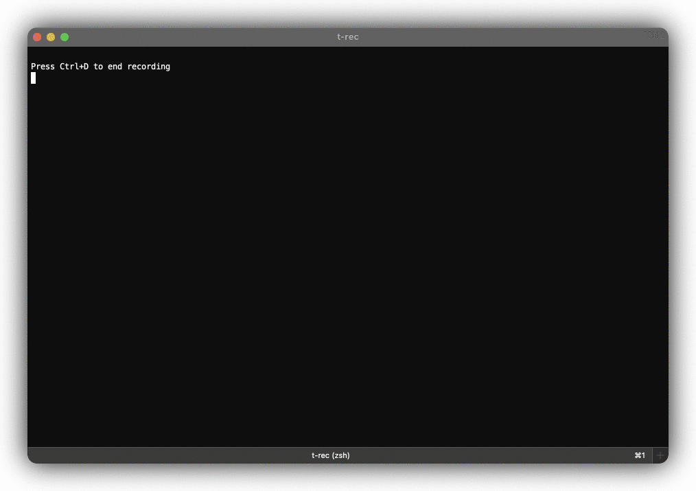

<div align="center">
 
 <h1><strong>t-rec: Terminal Recorder</strong></h1>

[](https://www.gnu.org/licenses/gpl-3.0)
[](https://crates.io/crates/t-rec)
[](https://deps.rs/repo/github/sassman/t-rec-rs)
[](https://github.com/sassman/t-rec-rs/actions?query=branch%3Amain+workflow%3ABuild+)
[](https://github.com/Aaronepower/tokei)

Blazingly fast terminal recorder that generates animated gif images for the web written in rust.

</div>


# Demo



## Features
- Screenshotting your terminal with 4 frames per second (every 250ms)
- Generates high quality small sized animated gif images
- **Build-In idle frames detection and optimization** (for super fluid presentations)
- Applies (can be disabled) border decor effects like drop shadow
- Runs on MacOS and Linux
- Uses native efficient APIs
- Runs without any cloud service and entirely offline
- No issues with terminal sizes larger than 80x24
- No issues with fonts or colors
- No issues with curses based programs
- No issues with escape sequences
- No record and replay - just one simple command to rule them all
- Hidden feature: Record every window you want
- Written in Rust 🦀

## Installation on MacOS
### with homebrew
```sh
brew install t-rec
```

### with cargo
**NOTE** `t-rec` depends on `imagemagick`.
```sh
brew install imagemagick
cargo install -f t-rec 
```
**NOTE** `-f` just makes sure the latest version is installed

## Installation on Linux
### as snap

[](https://snapcraft.io/t-rec)

- installation [for Linux Mint](https://snapcraft.io/install/t-rec/mint)
- installation [for Arch Linux](https://snapcraft.io/install/t-rec/arch)

*TL;DR:*
```sh
sudo snap install t-rec --classic
/snap/bin/t-rec --version
t-rec 0.4.3
```

### with cargo
```sh
sudo apt-get install libx11-dev imagemagick
cargo install -f t-rec
```

| tested on those distros |
|-------------------------|
| ubuntu 20.10 on GNOME |
|  |
| ubuntu 20.10 on i3wm | 
|  |
| linux mint 20 on cinnamon | 
|  |
| ArcoLinux 5.4 on Xfwm4 | 
|  |

## Usage
```sh
t-rec
```

or with specifying a different program to launch

```sh
t-rec /bin/sh
```

### Full Options

```sh
t-rec --help
t-rec 0.4.3
Sven Assmann <sven.assmann.it@gmail.com>
Blazingly fast terminal recorder that generates animated gif images for the web written in rust.

USAGE:
    t-rec [FLAGS] [OPTIONS] [shell or program to launch]

FLAGS:
    -h, --help       Prints help information
    -l, --ls-win     If you want to see a list of windows available for recording by their id, you can set env var
                     'WINDOWID' to record this specific window only.
    -n, --natural    If you want a very natural typing experience and disable the idle detection and sampling
                     optimization.
    -q, --quiet      Quiet mode, suppresses the banner: 'Press Ctrl+D to end recording'
    -V, --version    Prints version information
    -v, --verbose    Enable verbose insights for the curious.

OPTIONS:
    -b, --bg <bg>          Background color when decors are used [default: white]  [possible values: white, black,
                           transparent]
    -d, --decor <decor>    Decorates the animation with certain, mostly border effects. [default: shadow]  [possible
                           values: shadow, none]

ARGS:
    <shell or program to launch>    If you want to start a different program than $SHELL you can pass it here. For
                                    example '/bin/sh'
```

### Disable idle detection & optimization

If you are not happy with the idle detection and optimization, you can disable it with the `-n` or `--natural` parameter.
By doing so, you would get the very natural timeline of typing and recording as you do it. 
In this case there will be no optimizations performed.

### Disable shadow border decor

In order to disable the drop shadow border decor you have to pass `-p none` as an argument. If your only want to change 
the color of the background you can use `-b black` for example to have a black background.

## Hidden Gems

You can record not only the terminal but also every other window. There 2 ways to do so:

1) abuse the env var `TERM_PROGRAM` like this:
- for example lets record a window 'Google Chrome'
- make sure chrome is running and visible on screen

```sh
TERM_PROGRAM="google chrome" t-rec

Frame cache dir: "/var/folders/m8/084p1v0x4770rpwpkrgl5b6h0000gn/T/trec-74728.rUxBx3ohGiQ2"
Recording window: "Google Chrome 2"
Press Ctrl+D to end recording

```

this is how it looks then:


2) use the env var `WINDOWID` like this:
- for example let's record a `VSCode` window
- figure out the window id program, and make it 
- make sure the window is visible on screen
- set the variable and run `t-rec`

```sh
t-rec --ls-win | grep -i code
Code | 27600

# set the WINDOWID variable and run t-rec
WINDOWID=27600 t-rec

Frame cache dir: "/var/folders/m8/084p1v0x4770rpwpkrgl5b6h0000gn/T/trec-77862.BMYiHNRWqv9Y"
Press Ctrl+D to end recording

```

this is how it looks then:


## Contribute

To contribute to t-rec you can either checkout existing issues [labeled with `good first issue`][4] or [open a new issue][5] and describe your problem.
Also every PR is welcome. Support for Linux and Windows needs to be done.

## On the web & social media

- t-rec [on producthunt.com](https://www.producthunt.com/posts/t-rec)
- t-rec [on hacker news](https://news.ycombinator.com/item?id=24742378)
- t-rec [on reddit](https://www.reddit.com/r/rust/comments/j8tqs9/trec_a_blazingly_fast_terminal_recorder_that/)

## License

- **[GNU GPL v3 license](https://www.gnu.org/licenses/gpl-3.0)**
- Copyright 2020 - 2021 © [Sven Assmann][2].

[2]: https://www.d34dl0ck.me
[4]: https://github.com/sassman/t-rec-rs/issues?q=is%3Aissue+is%3Aopen+label%3A%22good+first+issue%22
[5]: https://github.com/sassman/t-rec-rs/issues/new/choose
