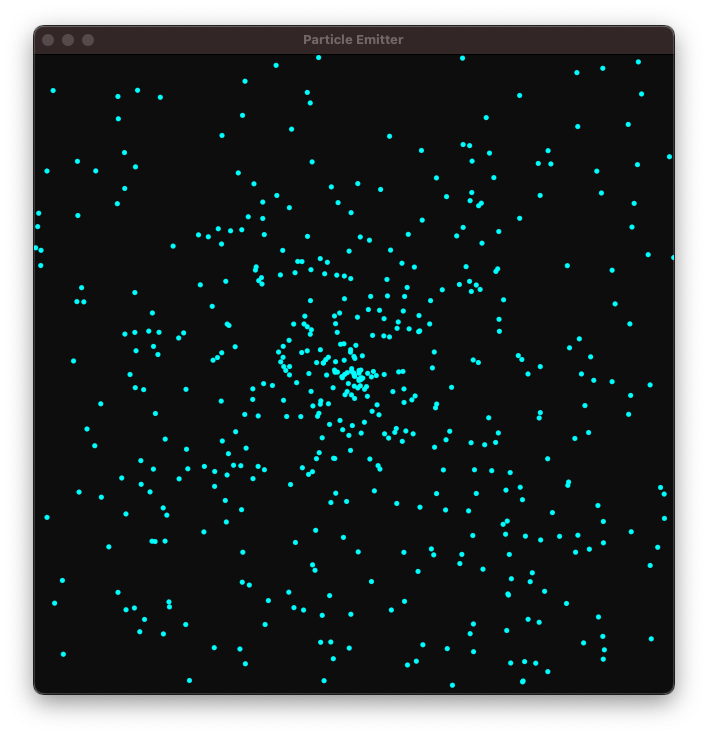
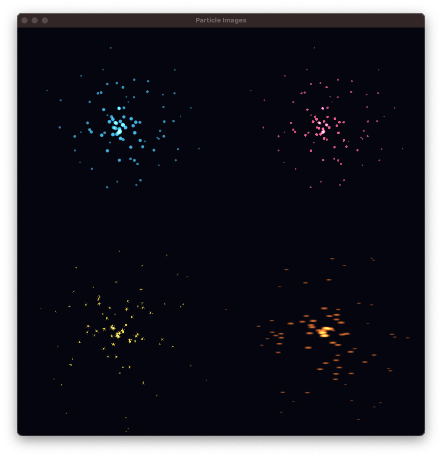
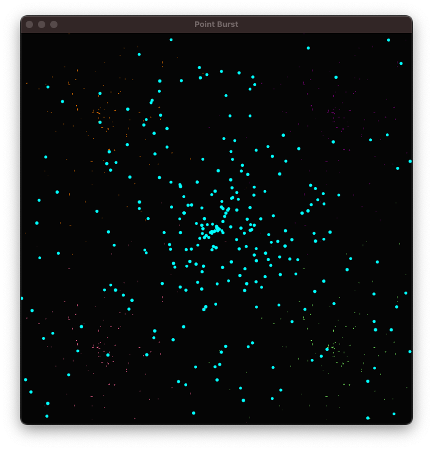

# Core Animation Examples

Examples demonstrating the `core-animation` crate's builder APIs.

## Running Examples

```bash
cargo run -p core-animation --example <name>
```

## Examples

### `window_builder`

Basic window creation with the `WindowBuilder` API.


```bash
cargo run -p core-animation --example window_builder
```

---

### `emitter`

Particle emitter using `CAEmitterLayerBuilder` with the closure-based particle configuration.



```bash
cargo run -p core-animation --example emitter
```

---

### `particle_images`

Showcases all `ParticleImage` types side by side:
- `soft_glow` - Radial gradient (top-left)
- `circle` - Solid circle (top-right)
- `star` - Multi-pointed star (bottom-left)
- `spark` - Elongated streak (bottom-right)



```bash
cargo run -p core-animation --example particle_images
```

---

### `point_burst`

Demonstrates `PointBurstBuilder` - a convenience API for the common pattern of particles bursting from a point in all directions.



```bash
cargo run -p core-animation --example point_burst
```

---

### `emitter_simple`

Direct port of Apple's CAEmitterLayer documentation example. Shows the fundamental concept: ONE emitter spawns MANY particles.


```bash
cargo run -p core-animation --example emitter_simple
```

---

### `sierpinski_particles`

Advanced example: Sierpinski triangle fractal using particle emitters. Particles stream from vertices and manifest into the final fractal shape.


```bash
cargo run -p core-animation --example sierpinski_particles
```

---

## Generating Screenshots

Screenshots can be automatically captured by running examples with the `screenshot` feature:

```bash
cargo run -p core-animation --example emitter --features screenshot
```

This captures a screenshot after a short delay and saves it to the `screenshots/` directory.
